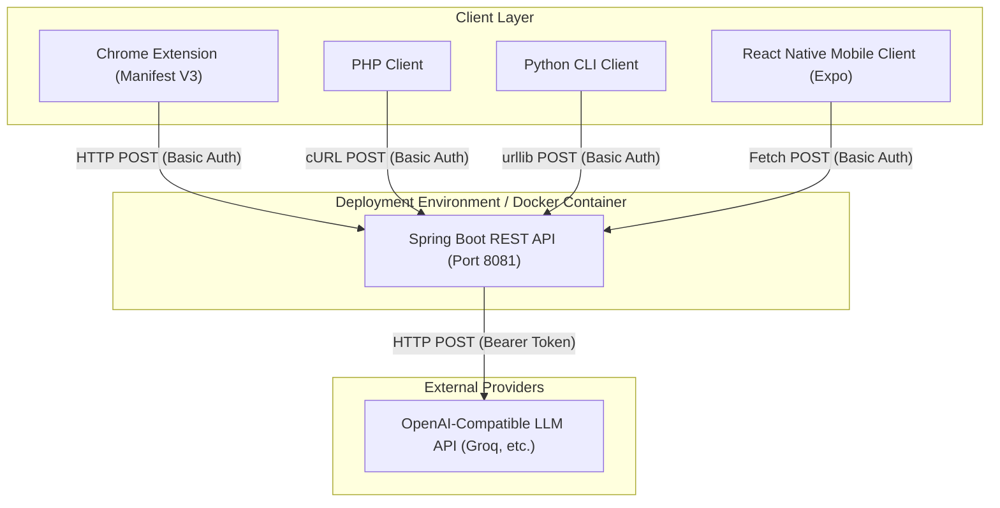
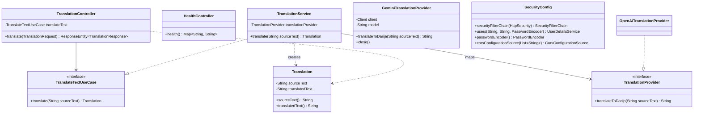

# Darija Side Panel Translator 🇲🇦

An LLM-powered translation system that translates English text into Moroccan Arabic Dialect (Darija). The project features a robust Spring Boot RESTful API backend integrated with any OpenAI-compatible LLM API (configured for Groq by default using the free `llama-3.3-70b-versatile` model), and multiple client applications: a Chrome Extension (Manifest V3), a PHP client, a Python client, and a React Native mobile client.

---

## Technical Architecture & UML Diagrams

### 1. Deployment Diagram
Illustrates the physical nodes of the system, showcasing client-server communication using Spring Security Basic Authentication and the backend communicating with the external LLM API (Groq, OpenAI, etc.).



### 2. Class Diagram
Details the internal clean/hexagonal architecture structure of the Spring Boot backend, mapping controllers, use cases, services, ports, and external infrastructure adapters.



---

## Features

- **Spring Boot Backend**:
  - Structured following Clean Architecture principles.
  - OpenAPI 3 specification generation via Springdoc.
  - Spring Security Basic Authentication using **BCrypt** password hashing.
  - `/health` endpoint for readiness/liveness checks.
- **Chrome Extension (Manifest V3)**:
  - Hosts content in the browser's side panel using the `chrome.sidePanel` API.
  - Context menu selection support ("Translate to Darija") which automatically populates and translates the text.
  - **Read Aloud** (Text-To-Speech) built-in utilizing the browser's native Web Speech API (`ar-MA`).
  - **Voice Input** (Speech-To-Text) using the Web Speech Speech Recognition API (`en-US`) for hands-free voice translation.
- **PHP Web Client**:
  - Structured cleanly with a decoupled `TranslationApiClient` class wrapper.
- **Python CLI Client**:
  - Features dynamic terminal inputs and environment verification.
- **React Native Mobile App**:
  - Designed using Expo, featuring a responsive mobile translation interface.

---

## Setup & Configuration

### Environment Variables
Configure the system by creating a `.env` file in the root directory (based on `.env.example`):

```bash
LLM_API_URL=https://api.groq.com/openai/v1/chat/completions
LLM_API_KEY=your_groq_api_key_here
LLM_MODEL=llama-3.3-70b-versatile
LLM_TIMEOUT_MS=30000
API_USERNAME=translator
API_PASSWORD=your_secure_password
API_URL=http://localhost:8081
```

### Spring Boot Backend
1. Ensure you have **Java 21** and **Maven** installed.
2. Build the package:
   ```bash
   mvn clean package
   ```
3. Run the Spring Boot application:
   ```bash
   mvn spring-boot:run
   ```
4. Access OpenAPI Swagger Docs at `http://localhost:8080/swagger-ui.html`.

### Docker Deployment
Build and run using the provided `Dockerfile`:
```bash
# Build the image
docker build -t darija-sidepanel-translator .

# Run the container
docker run -p 8080:8080 --env-file .env darija-sidepanel-translator
```

### Clients Setup

#### 1. Chrome Extension
1. Open Chrome and navigate to `chrome://extensions/`.
2. Enable **Developer mode** (top-right toggle).
3. Click **Load unpacked** (top-left) and select the `chrome-extension` directory.
4. Click the extension options/settings cog icon ⚙️ to configure your backend `API_URL`, `API_USERNAME`, and `API_PASSWORD`.

#### 2. PHP Client
Start a local PHP development server from the `php-client` folder:
```bash
# Run with environment variables set
API_URL="http://localhost:8080" API_USERNAME="translator" API_PASSWORD="your_password" php -S localhost:8000
```
Then visit `http://localhost:8000` in your browser.

#### 3. Python Client
Run the CLI translator script:
```bash
cd python-client
export API_URL="http://localhost:8080"
export API_USERNAME="translator"
export API_PASSWORD="your_password"

# Translate by passing text directly
python3 translator.py "How are you doing today?"

# Or run interactively
python3 translator.py
```

#### 4. React Native App (Expo)
Install dependencies and launch the app:
```bash
cd mobile-client
npm install
npm run start
```
Use Expo Go on your mobile device to scan the QR code and test the app.
